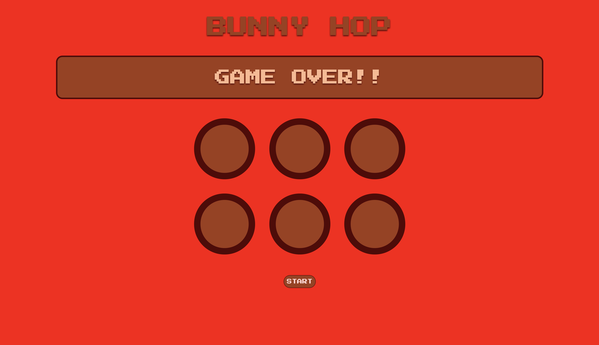

# <a href= "https://shray0027.github.io/BunnyHop/">BUNNY HOP</a>
In this user have to click the pattern in which bunny is moving successively in each round
## FEATURES
* Game over Animation
* Different sound for responses
## PREVIEW
<table>
<tr>
Desktop Preview
</tr>
<tr><td>Starting Screen</td><td>levels</td><td>game over</td>
<tr>
<td>
 
</td>
<td></td>
 <td></td>
</tr>

</table>
